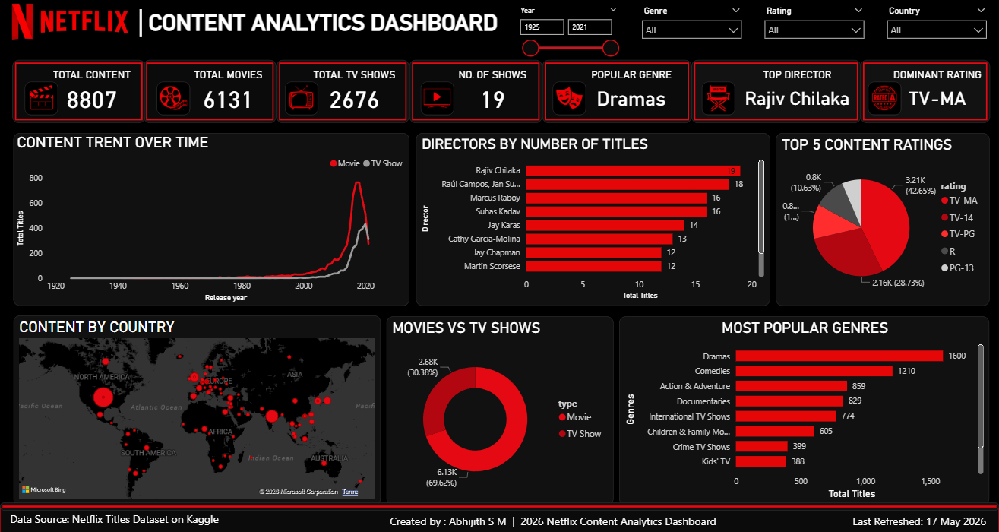

# Netflix Content Analytics Dashboard

## Overview
This project is a Netflix Content Analytics Dashboard built using Power BI and SQL.

## Tools Used
- Power BI
- SQL
- Excel / CSV Dataset

## Dashboard Features
- Total Movies & TV Shows
- Popular Genres
- Director Analysis
- Ratings Analysis
- Country-wise Content Distribution
- Content Trend Over Time

## Dashboard Preview

## Dataset
Netflix Titles Dataset from Kaggle.

## Created By
Abhijith S M
